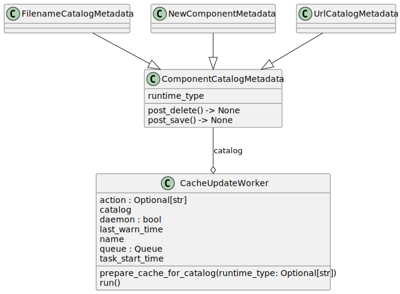
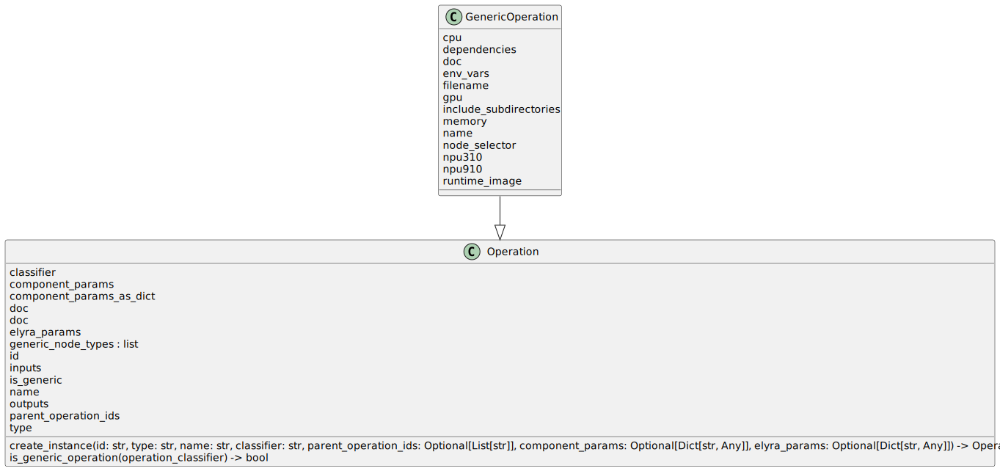

## 一、整体架构

```
├── elyra
├── packages
└── pipeline-editor
```

项目主体架构分为前端和后端两大部分，前端部分以 TypeScript 语言为主，对应 packages 目录和 pipeline-editor 目录，其中 packages 目录为 wfeeditor 前端主体部分，pipeline-editor 目录是三方库，主要实现画布上表单、编辑细节等操作；后端部分以 Python 语言为主，对应 elyra 目录。


## 二、前端代码架构

### 1. packages 目录

```
├── metadata
├── metadata-common
├── pipeline-editor
├── services
└── ui-components
```

#### metadata

定义元数据基本界面操作，定义元数据是基于 JupyterLab 的前端插件。


#### metadata-common

定义左侧边栏元数据展示及具体按钮操作，定义元数据编辑界面展示及具体操作。


#### pipeline-editor

定义 pipeline 和 workflow 编辑器画布上基本界面操作，定义编辑器是基于 JupyterLab 的前端插件。

```
├── ComponentCatalogsWidget.tsx
├── dialogs.tsx
├── EmptyPipelineContent.tsx
├── FileSubmissionDialog.tsx
├── formDialogWidget.ts
├── index.ts
├── PipelineEditorWidget.tsx
├── PipelineExportDialog.tsx
├── pipeline-hooks.ts
├── PipelineService.tsx
├── PipelineSubmissionDialog.tsx
├── RuntimeConfigSelect.tsx
├── RuntimeImagesWidget.tsx
├── RuntimesWidget.tsx
├── runtime-utils.ts
├── SubmitFileButtonExtension.tsx
├── theme.tsx
└── utils.ts
```

- index.ts、PipelineEditorWidget.tsx、pipeline-hooks.ts

  编辑器主体部分代码

- dialogs.tsx、FileSubmissionDialog.tsx、formDialogWidget.ts、PipelineSubmissionDialog.tsx

  一些界面上所弹出的对话框展示及页面处理代码

- EmptyPipelineContent.tsx

  空画布展示代码

- ComponentCatalogsWidget.tsx

  组件目录元数据展示及页面处理代码

- PipelineService.tsx

  画布上请求后端操作的代码

- RuntimeImagesWidget.tsx

  运行时镜像元数据展示及页面处理代码

- RuntimesWidget.tsx

  运行时配置元数据展示及页面处理代码


#### services

定义前端向后端请求处理类和元数据后端请求相关服务。


### 2. pipeline-editor 目录

为编辑器画布服务的三方库。

```
├── CustomFormControls
├── errors
├── IconButton
├── NodeTooltip
├── PalettePanel
├── PipelineController
├── PipelineEditor
├── properties-panels
├── SplitPanelLayout
├── TabbedPanelLayout
└── ThemeProvider

```

- PipelineEditor

  定义画布节点相关操作，包括右键菜单、属性面板等操作

- CustomFormControls

  自定义表单控件格式，例如表单数组控件、文件选择控件、oneOf 控件、错误提示等

- properties-panels

  定义属性面板界面展示，包括 Pipeline Properties （pipeline 和 workflow 属性面板）和 Node Properties （节点属性面板）


## 三、后端代码架构

主要包括元数据管理（metadata 目录）和编辑器服务（pipeline 目录）两大部分。

```
├── metadata
├── pipeline
├── static
├── templates
└── util
```

- static

  图片文件

- templates

  jinja2 模板文件，用于 react-jsonschema-form 制作表单

- util

  工具类函数

### 1. 元数据管理

```
├── error.py
├── handlers.py
├── __init__.py
├── manager.py
├── metadata_app.py
├── metadata_app_utils.py
├── metadata.py
├── schema.py
├── schemas
│   ├── code-snippet.json
│   ├── component-editor.json
│   ├── kfp.json
│   ├── local-file-catalog.json
│   ├── metadata-test2.json
│   ├── metadata-test.json
│   ├── meta-schema.json
│   ├── new-component.json
│   ├── runtime-image.json
│   ├── url-catalog.json
│   └── wfp.json
├── schemaspaces.py
├── schemasproviders.py
└── storage.py

```

- schemas
  - component-editor.json
  
    组件页面编辑 json schema
  
  - kfp.json
  
    Kubeflow Pipelines 运行时配置 json schema
  
  - local-file-catalog.json
  
    从本地文件新建组件分类目录 json schema
  
  - new-component.json
  
    新建组件 json schema
  
  - url-catalog.json
  
    从 url 地址新建组件分类目录 json schema
  
  - wfp.json
  
    Workflow 运行时配置 json schema 
  
- handlers.py

  前端与元数据相关请求处理入口

- manager.py

  元数据管理类，处理元数据的增删查改

- metadata.py

  元数据类

- schema.py、schemaspaces.py、schemasproviders.py

  Runtimes、RuntimeImages、CodeSnippets、ComponentCatalogs 四种 schema 的相关操作

- storage.py

  元数据存储在文件中的相关操作

  

### 2. 编辑器服务

```
├── catalog_connector.py
├── component_catalog.py
├── component_metadata.py
├── component_parameter.py
├── component.py
├── elyra_engine.py
├── handlers.py
├── __init__.py
├── kfp
│   ├── component_parser_kfp.py
│   ├── __init__.py
│   ├── kfp_authentication.py
│   ├── kfp_component_utils.py
│   ├── kfp_metadata.py
│   └── processor_kfp.py
├── parser.py
├── pipeline_constants.py
├── pipeline_definition.py
├── pipeline.py
├── processor.py
├── runtimes_metadata.py
├── runtime_type.py
├── validation.py
└── wfp
    ├── component_parser_wfp.py
    ├── __init__.py
    ├── processor_wfp.py
    ├── wfp_component_utils.py
    └── wfp_metadata.py
```

- kfp
  - component_parser_kfp.py
  
    kfp 组件 yaml 解析
  
  - kfp_authentication.py
  
    kfp 运行时配置中身份信息验证
  
  - kfp_component_utils.py
  
    kfp 组件 yaml 模板
  
  - kfp_metadata.py
  
    特定于 kfp 运行时对 RuntimesSchema 的修改
  
  - processor_kfp.py
  
    kfp 运行时的 pipeline 运行与导出
  
- wfp
  - component_parser_wfp.py
  
    workflow 组件 yaml 解析
  
  - processor_wfp.py
  
    workflow 检查、导出与上传
  
- catalog_connector.py

  组件唯一 id 生成，从文件系统或 url 获取组件与组件目录的信息

- component_catalog.py

  不同运行时及组件目录下组件信息缓存管理

- component_metadata.py

  组件目录元数据管理

- component_parameter.py

  组件 yaml 输入输出参数解析，DisableNodeCaching、EnvironmentVariable、KubernetesSecret、VolumeMount、KubernetesAnnotation、KubernetesLabel 和 KubernetesToleration 参数类

- component.py

  组件类 Component，包含组件所有信息；组件解析类 ComponentParser，解析不同运行时组件 yaml

- handlers.py

  前端与编辑器相关请求处理入口

- parser.py

  画布生成的文件信息解析

- pipeline_constants.py

  pipeline 中使用的常量定义

- pipeline_definition.py

  描述画布生成的 json 文件信息的辅助类

- pipeline.py

  Pipeline 类，存储画布生成的 json 文件解析后信息；Operation 类，Pipeline 类解析后生成的用于导出的 kfp 组件信息类；GenericOperation，Pipeline 类解析后生成的用于导出的通用组件信息类

- processor.py

  画布生成的文件信息处理基本类，根据运行时不同分发给 kfp 与 wfp 分别处理

- runtime_type.py

  运行时类型管理，包括 Kubflow Pipelines 和 Workflow 两种运行时

- runtimes_metadata.py

  运行时元数据基本类 RuntimesMetadata

- validation.py

  pipeline 导出前检查管理类 PipelineValidationManager，检查错误信息结构类 ValidationResponse


## 四、包图

### metadata


### pipeline


## 五、类图

### Authenticator


### ComponentCache


### ComponentCatalogConnector


### ComponentCatalogMetadata




### ComponentParser


### ElyraProperty


### Metadata


### Operation




### PipelineParser


### PipelineProcessor


### Schemaspace


### SchemasProvider


### StorageMetadata


