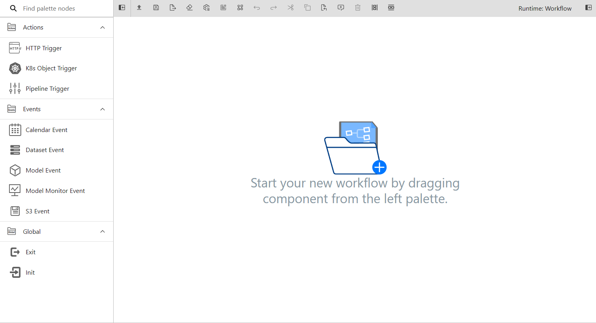
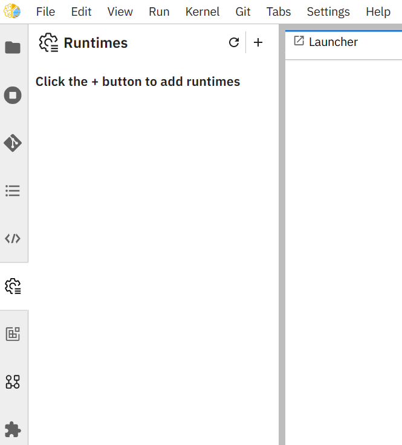
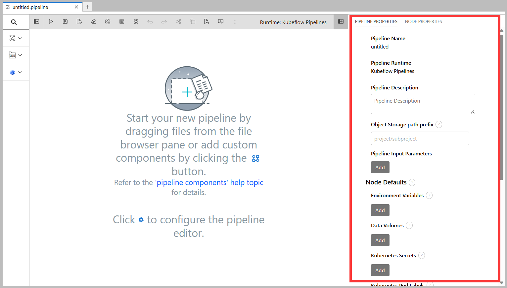
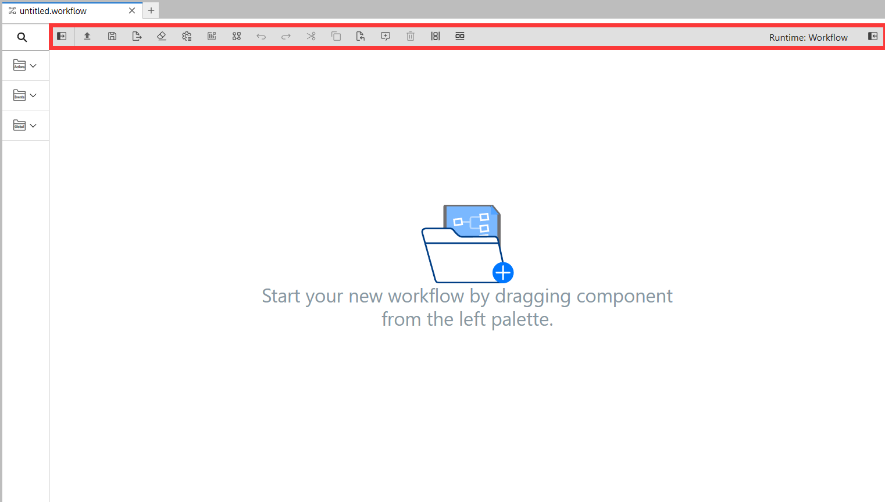
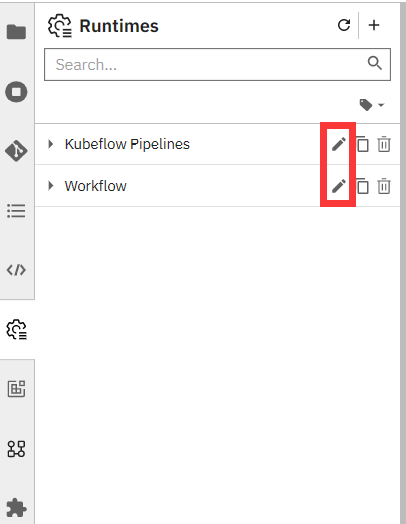
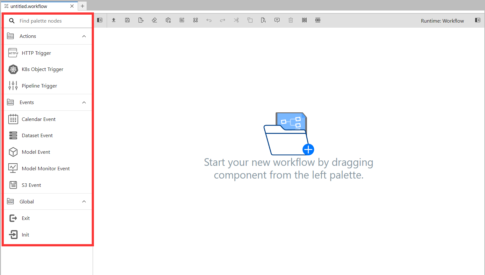
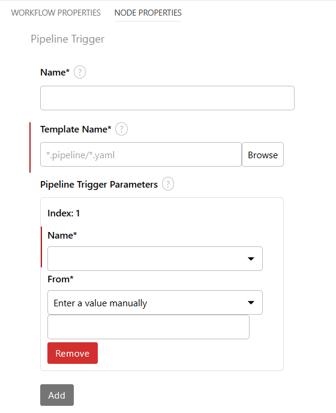

## 一、概述

wfeeditor 是基于 [Elyra v3.12.0](https://github.com/elyra-ai/elyra/tree/v3.12.0) 开发的 JupyterLab Notebooks 拓展，主要功能包括：

- [可视化 Pipeline 编辑器](#可视化 Pipeline 编辑器)

- [可视化 Workflow 编辑器](#可视化 Workflow 编辑器)

- [可视化组件管理](#可视化组件管理)

- [运行时管理](#运行时管理)

其他功能请参阅[ Elyra 官方文档](https://elyra.readthedocs.io/en/v3.12.0/getting_started/overview.html)。


### 可视化 Pipeline 编辑器

wfeeditor 提供了一个为模型构建 pipeline 的可视化编辑器，用于从 kfp 自定义组件、notebook 文件、Python 脚本或 R 脚本构建 pipeline，简化了从多个组件或脚本文件构建 pipeline 的过程。

当前 pipeline 编辑器支持顺序、分支和循环逻辑，使用 Argo 作为 pipeline 引擎，能够完成编辑、导出、运行等操作。


### 可视化 Workflow 编辑器

workflow 用于封装多个 pipeline 及相关 Event ，组合成一个独立的对象，避免用户看到零散的 pipeline，不方便管理和使用。

wfeeditor 提供可视化 workflow 编辑器，支持 HTTP Trigger、K8s Object Trigger、Pipeline Trigger、Calendar Event、Dataset Event、Model Event、Model Monitor Event、S3 Event、Init 和 Exit 组件的编辑与组合，支持导出、上传等操作。




### 可视化组件管理

wfeeditor 支持自定义 kfp 组件的新建、导入、分类和编辑操作，详细使用方法请参阅 [Pipeline 组件](#3. Pipeline 组件)。


### 运行时管理

允许通过配置文件或界面配置运行时，以提供 pipeline 导出与运行、workflow 导出与上传操作所需配置，详细使用方法请参阅[运行时配置](#2. 运行时配置)。


## 二、安装与启动

### 1. 源代码构建与本地启动

#### 安装 Miniconda

- 下载`build.sh`  （根据操作系统下载对应脚本，本文档以linux-x86_64为例）

```shell
wget https://repo.anaconda.com/miniconda/Miniconda3-latest-Linux-x86_64.sh
```

- 执行安装脚本

```shell
chmod +x Miniconda3-latest-Linux-x86_64.sh
./Miniconda3-latest-Linux-x86_64.sh
```

- 验证 conda 是否安装成功（需要重启shell）

```shell
conda -h
```

#### 配置 wfeeditor 编译环境

- 创建 conda 环境并激活

```shell
conda create -n <env-name> python
conda activate <env-name>
```

- 验证 conda 环境是否配置成功

```shell
python --version
which python
pip3 --version
which pip3
```

- 安装 node.js 并验证

```shell
conda install -y -c conda-forge/label/main nodejs
node --version 
```

- 安装 yarn 并验证

```shell
conda install -y -c conda-forge/label/main yarn
yarn --version 
```

#### 编译与构建

- 拉取项目工程

```shell
git clone -b workflow https://github.com/WangQing-WUT/elyra.git
cd elyra
```

- 编译安装

```shell
make clean install
```

- 验证扩展是否被正确安装

```shell
jupyter serverextension list
```

#### 本地启动

- 拷贝运行时配置到 jupyter 目录下

```shell
cp elyra/runtime_config/* ~/.local/share/jupyter/metadata/runtime
```

- 启动 wfeeditor

```shell
jupyter lab --allow-root
```

- 通过浏览器访问本机的8888端口来使用带有 wfeeditor 拓展的 JupyterLab，首次使用需要输入token，可以在启动日志中获取

```shell
    To access the server, open this file in a browser:
        file:///root/.local/share/jupyter/runtime/jpserver-725259-open.html
    Or copy and paste one of these URLs:
        http://localhost:8888/lab?token=f4315773ab321815ffe9043cd2077e12e14239d01d82f2e6
     or http://127.0.0.1:8888/lab?token=f4315773ab321815ffe9043cd2077e12e14239d01d82f2e6
```

可以在启动 wfeeditor 前执行以下语句，浏览器访问时将不再需要输入 token。

```shell
jupyter notebook --generate-config -y
echo "c.NotebookApp.token = ''" >> ~/.jupyter/jupyter_notebook_config.py
```


### 2. 镜像构建与容器启动

#### 镜像制作

执行完[源代码构建与本地启动](#1. 源代码构建与本地启动)的[编译与构建](#编译与构建)后，执行以下步骤即可制作镜像文件。

```shell
cd elyra
make install
make elyra-image
```

#### 容器启动

- 镜像拉取

```shell
docker pull wfeeditor:latest
```

- 挂载目录创建

为保证容器内数据持久化存储，建议将 wfeeditor 元数据和容器内工作目录挂载到主机上。

在主机上新建 metadata 目录存储元数据，新建 wfeeditor-work 目录存储工作目录文件。

```shell
mkdir ~/metadata
mkdir ~/wfeeditor-work
chmod 777 ~/metadata ~/wfeeditor-work
```

- 运行时配置导入

启动前配置运行时信息，请执行以下语句：

```shell
mkdir ~/metadata/runtimes
cp elyra/runtime_config/*.json ~/metadata/runtimes
chmod 777 ~/metadata/runtimes ~/metadata/runtimes/*.json
```

- 启动命令

```shell
docker run -it -v ~/metadata:/home/jovyan/.local/share/jupyter/metadata -v ~/wfeeditor-work:/home/jovyan/work -p 8888:8888 wfeeditor:latest
```


## 三、用户指南

### 1. Wfeeditor JupyterLab 界面

wfeeditor 拓展为 JupyterLab GUI 添加多个接口，这些接口用于创建和管理元数据、pipeline 和 workflow。

#### 1.1 Launch 界面

- Notebook 分类

  点击新建一个 .ipynb 文件，可以在线编辑和调试。

- Console 分类

  点击打开 Python 命令行界面。

- Elyra 分类

  - Pipeline Editor

    点击新建一个 .pipeline 文件，打开 pipeline 编辑界面。

  - Workflow Editor

    点击新建一个 .workflow 文件，打开 workflow 编辑界面。

- Other 分类
  - Terminal（命令行）
  - Text File（.txt 文件）
  - Markdown File（.md 文件）
  - Python File（.py 文件）


#### 1.2 元数据管理侧边栏

wfeeditor 在 JupyterLab的左侧边栏中添加了多个选项卡，这些选项卡提供对元数据的访问，这些元数据主要应用于 pipeline 和 workflow。

 

##### 管理运行时配置

运行时配置管理用于运行 pipeline 和 workflow 的运行时环境的访问，要管理运行时配置时，请打开此选项卡。

 

##### 管理运行时镜像配置

运行时镜像配置标识容器镜像，可为 notebook 文件、Python 脚本或 R 脚本配置相应的容器镜像，利用这些镜像在基于容器的的平台（例如Kubeflow Pipeline）上运行 pipeline，默认运行时镜像包含了一些常用基础镜像，此部分一般不需要修改。

 

##### 管理组件目录及组件编辑

提供自定义 kfp 组件的编辑及目录管理，要管理 kfp 组件，请打开此选项卡。

 


#### 1.3 Pipeline 编辑器界面

进入pipeline编辑器界面有三种方式：

- Launcher 界面点击 Pipeline Editor 选项卡，新建一个 .pipeline 文件
- 最上方工具栏，依次点击 File -> New -> Pipeline Editor，新建一个 .pipeline 文件

- 点击 JupyterLab 最左侧 File Browser选项卡，双击文件浏览器下的 .pipeline 文件，打开编辑已经存在的 .pipeline 文件

##### 工具栏


鼠标悬浮在按钮上方可以看到按钮描述，从左至右依次是：

- Palette: 展开或关闭组件面板
- Open Pipeline: 从文件系统打开一个 .pipeline 文件

- Run Pipeline: 运行 pipeline
- Save Pipeline: 保存 pipeline
- Export Pipelie: 导出 pipeline
- Clear Pipeline: 清空当前 pipeline 画布内容
- Open Runtimes: 打开运行时管理选项卡
- Open Runtime Images: 打开运行时镜像管理选项卡
- Open Component Catalogs: 打开组件目录管理选项卡
- Undo: 撤销上一次操作（ctrl + z）
- Redo: 恢复上一次操作（ctrl + y）
- Cut: 剪切选中（ctrl + x）
- Copy: 复制选中（ctrl + c）
- Paste: 粘贴（ctrl + v）
- Add Comment: 给节点添加注释
- Delete: 删除选中
- Arrange Horizontally: 水平排列画布节点
- Arrange Vertically: 垂直排列画布节点

- Open Panel: 打开属性面板

##### 组件面板


默认情况下包含 Generic 和 Logic 目录，用户添加的自定义 kfp 组件目录也会出现在组件面板下，目录按字母表顺序排序，详细介绍请参阅 [Pipeline 组件面板](#4.1 Pipeline 组件面板)。

##### 属性面板



包含 [Pipeline 属性面板](#4.2 Pipeline 属性面板)和 [Pipeline Node 属性面板](#4.5 Pipeline Node 属性面板)两部分。


#### 1.4 Workflow 编辑器界面

进入 workflow 编辑器界面有三种方式：

- Launcher 界面点击 Workflow Editor 选项卡，新建一个 .workflow 文件
- 最上方工具栏，依次点击 File -> New -> Workflow Editor，新建一个 .workflow 文件

- 点击 JupyterLab 最左侧 File Browser选项卡，双击文件浏览器下的 .workflow 文件，打开编辑已经存在的 .workflow 文件

##### 工具栏



鼠标悬浮在按钮上方可以看到按钮描述，从左至右依次是：

- Palette: 展开或关闭组件面板
- Open Pipeline: 从文件系统打开一个 .pipeline 文件

- Upload Workflow: 上传 workflow
- Save Workflow: 保存 workflow
- Export Workflow: 导出 workflow
- Clear Workflow: 清空当前 workflow 画布内容
- Open Runtimes: 打开运行时管理选项卡
- Open Runtime Images: 打开运行时镜像管理选项卡
- Open Component Catalogs: 打开组件目录管理选项卡
- Undo: 撤销上一次操作（ctrl + z）
- Redo: 恢复上一次操作（ctrl + y）
- Cut: 剪切选中（ctrl + x）
- Copy: 复制选中（ctrl + c）
- Paste: 粘贴（ctrl + v）
- Add Comment: 给节点添加注释
- Delete: 删除选中
- Arrange Horizontally: 水平排列画布节点
- Arrange Vertically: 垂直排列画布节点

- Open Panel: 打开属性面板

##### 组件面板


包含 Actions、Events 和 Global 目录，详细介绍请参阅 [Workflow 组件面板](#5.1 Workflow 组件面板)。

##### 属性面板


包含 [Workflow 属性面板](#5.2 Workflow 属性面板)和 [Workflow Node 属性面板](#5.3 Workflow Node 属性面板)两部分。


### 2. 运行时配置

#### 2.1 使用 JupyterLab GUI 管理运行时配置

##### 添加 Kubeflow Pipelines 运行时配置

- 最左侧选项卡 Runtimes -> +按钮 -> New Kubeflow Pipelines runtime configuration


- 提供运行时配置显示名称、描述（可选字段）

- 提供 Kubeflow Pipelines 部署信息，请参阅 [Kubeflow Pipelines 配置](https://elyra.readthedocs.io/en/latest/user_guide/runtime-conf.html#kubeflow-pipelines-configuration-settings)填写相关信息

- 提供云存储连接信息，请参阅[云存储设置](https://elyra.readthedocs.io/en/latest/user_guide/runtime-conf.html#cloud-storage-settings)填写相关信息

- 保存运行时配置，新条目将示在列表中。展开条目可以查看配置信息中的 Kubeflow Pipelines API Endpoint 和 Cloud Object Storage Endpoint

 

##### 添加 Workflow 运行时配置

- 最左侧选项卡 Runtimes -> +按钮 -> New Workflow runtime configuration

 

- 提供运行时配置显示名称、描述（可选字段）

- 提供 Workflow 部署信息

- 提供云存储连接信息，用于 pipeline 的导出，请参阅[云存储设置](https://elyra.readthedocs.io/en/latest/user_guide/runtime-conf.html#cloud-storage-settings)填写相关信息
- 保存运行时配置，新条目将示在列表中。展开条目可以查看配置信息中的 Workflow API Endpoint 和 Cloud Object Storage Endpoint

 

##### 修改运行时配置

点击运行时配置右侧的的修改按钮。

 


##### 复制运行时配置

点击运行时配置右侧的的复制按钮。

 


##### 删除运行时配置

点击运行时配置右侧的的删除按钮，确认后删除。

 


#### 2.2 使用配置文件管理运行时

wfeeditor 启动前，将配置文件放置在 ~/.local/share/jupyter/metadata/runtimes/ 目录下，即可完成运行时配置。

若 wfeeditor 已经启动，手动修改 ~/.local/share/jupyter/metadata/runtimes/ 目录下配置文件，或添加新的配置文件到该目录下，请点击 Runtime 选项卡中的刷新按钮，更新运行时配置。

 


### 3. Pipeline 组件

#### 3.1 从文件系统导入组件

- 最左侧选项卡 Component Catalogs -> +按钮 -> New Filesystem Component Catalog


- 属性填写

  - Category Name

    新建分类名称，不区分大小写，注意不要与当前分类名称重复，不能与 Global、Actions、Triggers 和 Logic 重复

  - Description:

    分类描述，可选字段

  - Path:

    组件 yaml 文件路径，通过 File Browser 选择


#### 3.2 从 URL 导入组件

- 最左侧选项卡 Component Catalogs -> +按钮 -> New URL Component Catalog


- 属性填写

  - Category Name:

    新建分类名称，不区分大小写，注意不要与当前分类名称重复，不能与 Global、Actions、Triggers 和 Logic 重复

  - Description:

    分类描述，可选字段

  - URLs:

    组件 yaml 文件下载网址

  - User Id:

    特定 URL 资源读取所需提供的用户 Id

  - Password:

    用户 Id 所对应的密码或 API 密钥


#### 3.3 新建组件

- 最左侧选项卡 Component Catalogs -> +按钮 -> New Component


- 属性填写

  - Component Categories

    - Category Name

      分类名称，不区分大小写，可以与当前分类名称重复，重复时将加入该分类，否则新建分类，不能使用 Global、Actions、Triggers 和 Logic 分类名称

    - Description:

      分类描述，可选字段

  - Component Properties

    - Name

      新建组件名称

    - Description

      新建组件描述

    - Input Parameters

      新建组件输入参数

      Name: 输入参数名称

      Placeholder Type: 输入参数占位符类型，包含 inputValue 和 inputPath 两种类型，默认为 inputValue

      Value Type: 输入参数类型，包含 String、Integer、Float 和 Boolean 四种类型，默认为 String

      Default Value: 输入参数默认值，可选字段

      Description: 输入参数描述，可选字段

    - Output Parameters

      新建组件输出参数

      Name: 输出参数名称

      Placeholder Type: 输出参数占位符类型，仅有 outputPath 一种类型，默认为 outputPath

      Value Type: 输出参数类型，包含 String、Integer、Float 和 Boolean 四种类型，默认为 String

      Description: 输出参数描述，可选字段

  - implementation

    - Image Name

      镜像名称

    - Command

      容器执行命令，请以 yaml 数组格式输入，可以使用`{参数名称}`引用输入输出参数，也可以使用标准格式`{占位符类型: 参数名称}`引用输入输出参数

    - Args

      命令参数，请以 yaml 数组格式输入，可以使用`{参数名称}`引用输入输出参数，也可以使用标准格式`{占位符类型: 参数名称}`引用输入输出参数

  - File Info

    - File Name

      新建组件yaml文件名称，可选字段，默认与组件名称相同

    - Save Path

      新建组件 yaml 文件保存路径，可选字段，默认保存在启动目录下


#### 3.4 使用 JupyterLab GUI 管理组件

添加的组件分类以列表形式展示，分类条目右侧有四个功能性按钮用于管理组件分类，从左至右依次是：

- 刷新分类目录下的组件信息

  该分类下组件 yaml 信息修改时，需要点击该按钮刷新组件信息

- 编辑组件分类

  点击编辑组件分类，可以增删该分类下的组件，或修改分类名称

- 复制组件分类

  复制一个组件分类，然后可以在此基础上编辑复制的组件分类

- 删除组件分类

  点击删除该组件分类，确认后删除

 


#### 3.5 使用 JupyterLab GUI 编辑组件

添加的组件分类以列表形式展示，点击分类条目展开可以查看并编辑该分类下的组件。

##### 通过文本编辑器编辑

点击按钮 Editor from editor，使用文本编辑器打开该 yaml 文件，修改保存后，刷新对应分类目录下的组件信息。

 


##### 通过页面编辑

点击按钮 Editor from page，打开页面窗口编辑该 yaml 文件，修改保存后，刷新对应分类目录下的组件信息。

 


### 4. Pipeline 编辑器

#### 4.1 Pipeline 组件面板

Pipeline 组件面板以字母表顺序排序，包含通用组件分类 Generic、自定义 kfp 组件分类和特殊组件分类 Logic。


##### 4.1.1 通用组件

- Notebook组件

  处理 Notebook 文件

- Python Script组件

  处理 Python 脚本文件

- R Script组件

  处理 R 脚本文件


##### 4.1.2 特殊组件

- ParallelFor End

  循环结束组件

- ParallelFor Start

  循环开始组件，可以在 ParallelFor Start 节点定义循环所需参数

- Pipeline Branch

  分支组件，可以在 Pipeline Branch 节点定义分支条件


##### 4.1.3 自定义 kfp 组件

组件具体功能由组件 yaml 定义。


#### 4.2 Pipeline 属性面板

Pipeline 编辑器画布，单击右上角的 Open Panel 按钮，然后选择 PIPELINE PROPERTIES 选项卡，即可打开 Pipeline 属性面板。

  

##### 4.2.1 Pipeline 参数

Pipeline Input Parameters 是 pipeline 的全局参数，配置后可作为其他节点的参数输入引用。

 

- 参数介绍

  - Parameter Name

    参数名称，必填字段，不可与其他参数名称重复

  - Description

    参数描述，可选字段

  - Type

    参数类型，必填字段，下拉框选择["String", "List", "Integer", "Float", "Bool"]，默认为 String

  - Default Value

    默认值，可选字段

- 补充说明

若组件要引用全局参数，请确保组件参数与全局参数类型匹配关系正确，二者对应关系如下：

| **Pipeline 参数类型** | **Component 参数类型** |
| :-------------------: | :--------------------: |
|        String         |         String         |
|         List          |       JsonArray        |
|        Integer        |        Integer         |
|         Float         |         Float          |
|         Bool          |        Boolean         |


##### 4.2.2 默认节点属性

默认节点属性应用于所有适用的节点，但可以针对单个节点进行自定义。

- 适用于 kfp 节点和通用节点的默认属性
  - Environment Variables
  - Data Volumes
  - Kubernetes Secrets
  - Kubernetes Pod Labels
  - Kubernetes Pod Annotations
  - Kubernetes Tolerations
- 仅适用于 kfp 节点的默认属性
  - Disable node caching
- 仅适用于通用节点的默认属性
  - Runtime Image


#### 4.3 Pipeline Node 属性面板

##### 4.3.1 通用节点及 kfp 节点属性参考

以下按字母顺序排序的节点属性，标识了 Pipeline 编辑器中支持的节点属性。

###### 4.3.1.1 Data volumes

 

- 要装载到执行组件的容器中的 PVC 的列表

- 格式

  - Mount Path

    PVC在容器中的挂载路径，必填

  - Persistent Volume Claim Name

    一个有效的 Kubernetes 资源名称，用于标识执行管道节点的 Kubernetes 命名空间中存在的 PVC，必填，可手动输入，也可引用 pipeline 全局参数


###### 4.3.1.2 Disable node caching

 

- pipeline 节点生成输出，例如文件。某些运行时环境支持缓存这些输出，无需重新执行节点，这可以提高性能并减少资源使用。如果节点没有以确定性的方式生成输出（即，当给定相同的输入时，生成的输出是不同的），则重用以前执行的输出可能会导致意外结果

- 格式

  - True

    禁止节点输出缓存

  - False

    节点输出缓存

  - 未指定

    应用运行时环境的默认缓存行为


###### 4.3.1.3 Environment Variables

 

- 要在容器中设置的环境变量列表

- 格式

  - Environment Variable

    要设置的变量的名称，必填

  - Value

    要分配给所述变量的值，可选字段，可手动输入，也可引用 pipeline 全局参数

- 可以在 PIPELINE PROPERTIES 选项卡中设置默认环境变量，如果设置了任何默认环境变量，则节点属性选项卡中的环境变量属性将包括这些变量及其值，无法从节点属性选项卡中编辑管道默认环境变量。单个节点可以通过在其自己的节点属性中重新定义变量/值对来覆盖给定变量的管道默认值


###### 4.3.1.4 File Dependencies

 

- 此属性仅适用于通用组件

- 要从本地工作环境传递到 pipeline 的每个相应步骤的文件列表，文件应与与其关联的文件位于同一目录（或其子目录）中，指定一个文件或目录

- 如果指定的文件依赖项引用一个或多个目录，并且启用了 Include Subdirectories 选项，则提交 pipeline 时将会递归包含子目录

  

###### 4.3.1.5 Filename

 

- 此属性仅适用于通用组件

- 绑定与该通用组件相对应的文件类型，该文件存储在运行 JupyterLab 的文件系统中


###### 4.3.1.6 Kubernetes Pod Annotations

 

- 要附加到执行节点的 Pod 的 Annotation 列表

- 格式

  - Key

    有效的 Kubernetes Annotation Key，必填

  - Value

    要分配给 Annotation Key 的值，可选字段，可手动输入，也可引用 pipeline 全局参数


###### 4.3.1.7 Kubernetes Pod Labels

 

- 要附加到执行节点的 Pod 的标签列表

- 格式

  - Key

    有效的 Kubernetes 标签 Key，必填

  - Value

    要分配给标签 Key 的值，可选字段，可手动输入，也可引用 pipeline 全局参数


###### 4.3.1.8 Kubernetes Secrets

 

- 在节点执行期间作为环境变量访问 Kubernetes Secrets 列表

- 格式

  - Environment Variable

    要设置的变量的名称，必填

  - Secret Name

    一个有效的 Kubernetes 资源名称，用于标识执行 pipeline 节点的 Kubernetes 命名空间中存在的 Secret，必填，可手动输入，也可引用 pipeline 全局参数

  - Secret Key

    与 Secret Name 相对应的密钥内容，必填，可手动输入，也可引用 pipeline 全局参数


###### 4.3.1.9 Kubernetes Tolerations

 

- 要应用于执行组件的 pod 的 Kubernetes Toleration 列表

- 格式

  - Key

    可容忍的污点 Key

  - Operator

    表示键与值的关系，必须是 Equal 或 Exists

  - Value

    污点容忍度匹配的值

  - Effect

    表示要匹配的污点效果。如果指定，则必须为 NoExecute、NoSchedule 或 PreferNoSchedule


###### 4.3.1.10 Label

 

- 指定标签以替换默认节点名称。对于通用组件，默认标签是文件名。对于自定义组件，默认名称是组件名称


###### 4.3.1.11 Output Files

 

- 通用节点在镜像内生成的文件列表，将作为输入传递到 pipeline 的下一步。每行指定一个文件、目录或表达式，支持 * 和 ? 的匹配


###### 4.3.1.12 Resources: CPU, GPU, RAM, Ascend310, Ascend910, Node Selector

 

- 节点所需资源，包括 CPU 个数、GPU（nvidia.com/gpu）个数、RAM 大小（单位 GB）、NPU310（huawei.com/Ascend310）个数、NPU910（huawei.com/Ascend910）个数和 nodeSelect 节点调度指定


###### 4.3.1.13 Runtime image

 

- 用于运行通用节点的镜像
- 可以在 PIPELINE PROPERTIES 选项卡中设置默认运行时映像。如果设置了默认映像，则节点属性选项卡中的运行时映像属性将指示已设置默认值。单个节点可以重新设置覆盖默认值


##### 4.3.2 Pipeline Branch 组件属性面板

 

分支组件用于构建条件分支。

- Label

  分支名称

- Branch Condition

  分支条件

  - Parameter1

    参数1，可以选取 pipeline 全局参数或前面节点的输出作为参数1

  - Operate

    比较运算，可以是 ==、!=、>、>=、< 或 <= 

  - Parameter2

    参数2，可以手动输入一个值、选取 pipeline 全局参数或前面节点的输出作为参数2


##### 4.3.3 ParallelFor 组件属性面板

- ParallelFor Start

  循环开始组件，标志循环开始。

   

  - Loop Args

    循环参数列表。

    - Number

      设定固定次数的循环，循环内节点可以使用 item 引用当前是第几次循环的数字

    - List[str]

      字符串数组循环参数，循环内节点可以使用 item 引用每个字符串

    - List[int] or List[float]

      数字数组循环参数， 循环内节点可以使用 item 引用每个数字

    - List[Dict[str,any]]

      字典数组循环参数， 循环内节点可以使用 item 引用每个字典元素或 item.key 引用字典中的项

    - Select an output from a parent

      组件 List 类型输出作为循环参数，循环内节点可以使用 item 引用 List 中每个元素

- ParallelFor End

  循环结束组件，标志循环终止。


#### 4.4 添加节点

从组件栏拖拽相应的组件到画布上即可完成节点添加。对于 .py、.ipynb 和 .r 后缀的文件，可以直接从文件系统目录拖拽到画布上，分别生成 Python Script 节点、Notebook 节点和 R Script 节点。


#### 4.5 配置节点

大多数节点都需要先进行配置，然后才能使用。右键节点，在弹出的菜单中选择 Open Properties，或者双击节点，即可在画布右侧打开节点属性面板，进行节点配置。


#### 4.6 定义节点依赖关系

节点之间的依赖关系是通过连接它们来定义的，本质上是一个执行图。组件间有输入输出依赖需求的，可以将他们连接起来，这样后面的节点就可以使用前面节点的输出。除此以外，请遵循以下规则：

- 分支组件后面接分支组件为分支嵌套，循环组件后面接循环组件为循环嵌套
- 分支和循环内的节点，不要与非嵌套关系的其他分支和循环内的节点有依赖关系
- 使用 ParallelFor End 组件终止循环后，ParallelFor End 节点后面连接的节点不要使用循环内组件的输出


#### 4.7 导出 Pipeline

导出 Pipeline 时，wfeeditor 执行两项任务，一是把通用组件的依赖项打包并将其上传到云存储，二是生成 pipeline 的 yaml 文件。

1. 单击工具栏上的 Export Pipeline 

2. 弹出以下对话框，选择运行时配置文件，默认导出格式为 yaml，单击 OK

    

3. 若导出成功，在 pipeline 文件同目录下生成与其同名的 yaml 格式导出文件；若导出失败，请根据提示信息对当前 pipeline 进行修改


#### 4.8 运行 Pipeline

1. 单击工具栏上的 Run Pipeline 

2. 弹出以下对话框，填写要提交的 pipeline 名称，选择运行时配置文件，单击 OK

    

3. 若运行提交成功，请访问配置文件中指定的 Kubeflow Pipeline 仪表盘查看运行状态；若运行提交失败，请根据提示信息检查相应问题


### 5. Workflow 编辑器

#### 5.1 Workflow 组件面板

Workflow 组件面板以字母表顺序排序，包含 Actions 组件分类、Events 组件分类和 Global 组件分类。



##### 5.1.1 Actions 分类

分类[介绍]

- HTTP Trigger

  HTTP Trigger[介绍]

- K8s Object Trigger

  K8s Object Trigger[介绍]

- Pipeline Trigger

  Pipeline Trigger[介绍]


##### 5.1.2 Events 分类

分类介绍

- Calendar Event

  Calendar Event[介绍]

- Dataset Event

  Dataset Event[介绍]

- Model Event

  Model Event[介绍]

- Model Monitor Event

  Model Monitor Event[介绍]

- S3 Event

  S3 Event[介绍]


##### 5.1.3 Global 分类

- Init

  Init[介绍]

- Exit

  Exit[介绍]


#### 5.2 Workflow 属性面板

Workflow 编辑器画布，单击右上角的 Open Panel 按钮，然后选择 WORKFLOW PROPERTIES 选项卡，即可打开 Workflow 属性面板。

 

- Workflow Description

  workflow 描述，简要说明当前 workflow 功能

- Workflow Input Parameters

  workflow 全局输入参数

   

  - Parameter Name

    参数名称，必填字段，不可与其他参数名称重复

  - Description

    参数描述，可选字段

  - Type

    参数类型，必填字段，下拉框选择["String", "S3 Path", "Integer", "Float", "Bool"]，默认为 String

  - Default Value

    默认值，可选字段


#### 5.3 Workflow Node 属性面板

##### 5.3.1 公共属性 Name

 

组件名称，必填字段，由数字、小写字母和中划线组成，必须以小写字母开头，数字或小写字母结尾，画布上所有节点的 Name 不可重复。


##### 5.3.2 Init 节点属性面板

 

- Init Pipeline File

  Init 组件需要执行的 pipeline 文件，必填字段，可以是 .pipeline 后缀或 .yaml 后缀（pipeline 导出文件）的文件

- Init Parameters

  可选字段字段，若填写了该字段，则该字段会覆盖原来 pipeline 的全局参数默认值

  - Name

    参数名称，必填字段，下拉框选择所选 pipeline 文件的全局参数名称

  - Value

    参数值，必填字段，可以手动输入，也可引用 workflow 全局参数

  - Description

    参数描述，可选字段


##### 5.3.3 Exit 节点属性面板

 

填写规则同 Init 节点。


##### 5.3.4 Calendar Event 节点属性面板

 

- Calendar Event Filters

  必填字段，Calendar 组件定时策略

  - Interval

    固定时间间隔执行，可以手动输入，也可引用 workflow 全局参数，输入规则为：数字+时间单位（时分秒，hms），例如 5m 表示五分钟执行一次

  - schedule

    cron 定时策略，可以手动输入，也可引用 workflow 全局参数，输入要符合 cron 规范，可以参考下方链接 crontab.guru 寻求帮助

  - once

    只执行一次，可以手动输入，也可引用 workflow 全局参数，输入规则同 Interval


##### 5.3.5 Dataset Event 节点属性面板

 

- Dataset Names

  Dataset Name 数组[介绍]，必填字段，可以手动输入，也可引用 workflow 全局参数

- Dataset Event Filters

  Dataset Event 过滤规则，必填字段

  - Property Name 为 operate

    [介绍]

    - Operate

      比较运算，必填字段，只能为 ==

    - Value

      必填字段，可以手动输入，也可引用 workflow 全局参数，输入值只能是 create 或 delete

  - Property Name 为 sample

    [介绍]

    - Operate

      比较运算，必填字段，下拉框选择 [">", ">=", "==", "%", "delta"] 其中之一

    - Value

      必填字段，可以手动输入，也可引用 workflow 全局参数，输入值只能是正整数

- Expression

  过滤规则组合表达式，可选字段，若未填写 Expression 字段，默认过滤规则间按照 && 逻辑组合，若填写了 Expression 字段，按照 Expression 逻辑组合过滤规则


##### 5.3.6 Model Event 节点属性面板

 

- Model Names

  Model Name 数组[介绍]，必填字段，可以手动输入，也可引用 workflow 全局参数

- Model Event Filters

  Model Event 过滤规则，必填字段

  - Property Name

    属性名，必填字段，只能为operate

  - Operate

    比较运算，必填字段，只能为==

  - Value

    必填字段，可以手动输入，也可引用 workflow 全局参数，输入值只能是 create 或 delete

- Expression

  过滤规则组合表达式，可选字段，若未填写 Expression 字段，默认过滤规则间按照 && 逻辑组合，若填写了 Expression 字段，按照 Expression 逻辑组合过滤规则


##### 5.3.7 Model Monitor Event 节点属性面板

 

- Alter Name

  [介绍]，必填字段，可以手动输入，也可引用 workflow 全局参数，输入值只能是下拉框列表中所列出的值

- Model Configuration

  [介绍]，必填字段

  - App Name

    [介绍]，必填字段，可以手动输入，也可引用 workflow 全局参数

  - Model Name

    [介绍]，必填字段，可以手动输入，也可引用 workflow 全局参数


##### 5.3.8 S3 Event 节点属性面板

 

- Bucket Name

  [介绍]，必填字段，可以手动输入，也可引用 workflow 全局参数

- S3 Object Prefix

  [介绍]，可选字段，可以手动输入，也可引用 workflow 全局参数

- S3 Object Suffix

  [介绍]，可选字段，可以手动输入，也可引用 workflow 全局参数

- S3 Event Filters

  S3 Event 过滤规则

  - Property Name

    属性名，必填字段，只能为 operate

  - Operate

    比较运算，必填字段，只能为 == 或 !=

  - Value

    必填字段，可以手动输入，也可引用 workflow 全局参数，输入值只能是下拉框列表中所列出的值


##### 5.3.9 Events 输出参数

Actions 节点可以从所连接的 Events 节点获取 Events 输出参数，各 Event 所能输出的参数如下表所示。

|      **Event**      |         **输出参数**          |
| :-----------------: | :---------------------------: |
|   Calendar Event    |             time              |
|    Dataset Event    |   operate、samples、symbol    |
|     Model Event     |            operate            |
| Model Monitor Event |       alter、app、model       |
|      S3 Event       | bucket、object、operate、size |


##### 5.3.10 HTTP Trigger 节点属性面板

 

- HTTP URL

  [介绍]，必填字段，输入要符合 URL 格式

- HTTP Method

  [介绍]，必填字段，输入只能是下拉框列表中所列出的值，包括 GET、DELETE、PATCH、POST 和 PUT 方法

- Timeout

  [介绍]，必填字段，输入只能正整数

- HTTP Trigger Parameters

  [介绍]，可选字段

  - Name

    [介绍]，必填字段，

  - From

    [介绍]，必填字段，可以手动输入，也可引用 workflow 全局参数，也可以是所连接的 events 输出的参数


##### 5.3.10 K8s Object Trigger 节点属性面板

 

- Source

  [介绍]，必填字段，包括 s3 和 http 两种

  - s3

    [介绍]

    - Bucket Name

      [介绍]，必填字段

    - Object

      [介绍]，必填字段

  - http

    - URL

      [介绍]，必填字段，输入要符合 URL 格式

- Operation

  [介绍]，必填字段，输入只能是下拉框列表中所列出的值，包括 create、update 和 delete

- K8s Object Trigger Parameters

  - From

    [介绍]，必填字段，可以手动输入，也可引用 workflow 全局参数，也可以是所连接的 events 输出的参数

  - Destination

    [介绍]，必填字段


##### 5.3.11 Pipeline Trigger 节点属性面板

 

- Template Name

  Pipeline Trigger 所要执行的 pipeline 模板文件，必填字段，可以是 .pipeline 后缀或 .yaml 后缀（pipeline 导出文件）的文件

- Pipeline Trigger Parameters

  可选字段字段，若填写了该字段，则该字段会覆盖原来 pipeline 的全局参数默认值

  - Name

    参数名称，必填字段，下拉框选择所选 pipeline 模板文件的全局参数名称

  - From

    参数值，必填字段，可以手动输入，也可引用 workflow 全局参数，也可以是所连接的 events 输出的参数


#### 5.4 添加节点

从组件栏拖拽相应的组件到画布上即可完成节点添加。对于 .pipeline 后缀的文件，可以直接从文件系统目录拖拽到画布上，生成 Pipeline Trigger 节点。


#### 5.4 定义节点依赖关系

节点之间的依赖关系是通过连接它们来定义的，本质上是一个执行图。workflow 画布上共有三种节点：Actions、Events 和 Global，这三种节点依赖关系如下：

- Global 节点独立存在，不与其他节点有依赖关系，在一个 workflow 中，Init 和 Exit 节点最多只有一个
- Actions 和 Events 是多对多关系，只能从 Events 连向 Actions
- Actions 不可以单独存在，必须连接至少一个 Events


#### 5.6 导出 Workflow

导出 Workflow 时，wfeeditor 执行三项任务，一是把画布上出现的 pipeline 文件导出并封装（如果是 pipeline 的 yaml 文件，则直接进行封装），二是生成 workflow 的 yaml 文件，三是把前两者打包成 zip 包。

1. 单击工具栏上的 Export Workflow

2. 弹出以下对话框，选择运行时配置文件，默认导出格式为 yaml，单击 OK

 

3. 若导出成功，在 workflow 文件同目录下生成其文件名加后缀 -workflow 的 yaml 格式导出文件，pipeline 文件同目录下生成pipeline 导出的 yaml 文件以及该文件封装后加后缀 -pipeline 的 yaml 文件，在 workflow 文件同目录下生成加后缀 -workflow 和加后缀 -pipeline 打包成的 zip 文件；若导出失败，请根据提示信息对当前 workflow 或引用的 pipeline 文件进行相应修改


#### 5.7 上传 Workflow

1. 单击工具栏上的 Export Workflow

2. 弹出和导出 Workflow 相同的对话框，选择运行时配置文件，默认导出格式为 yaml，单击 OK，先进行 Workflow 导出，再进行 Workflow 上传

3. 若上传成功，请转至 wfeportal 界面查看模板情况；若导出失败，请根据提示信息对当前 workflow 、引用的 pipeline 文件或 workflow 后端返回的错误信息进行相应修改


